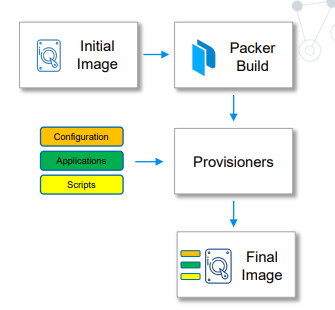
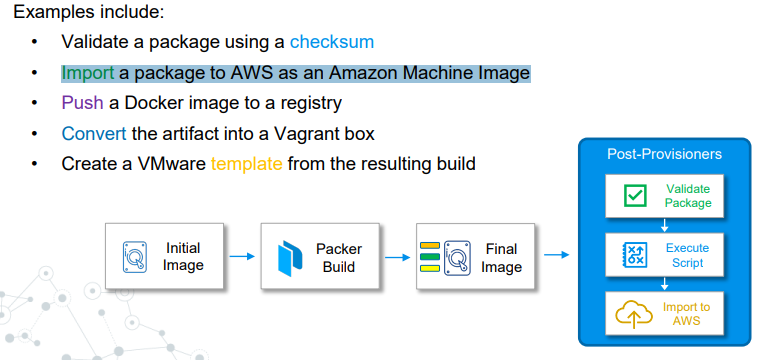
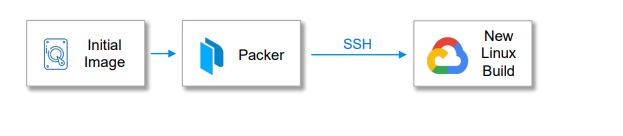

# Core Component of Packer solution

- when we start working with `packer` we need to create the `packer template`

- the `packer template` can be a `single or multiple file` which need to be `commited` and `stored into the source control`

- the `packer template` can be build using either `JSON` or `HCL(Hashicorp Configuration Language)`

- `JSON` is `old way of creating the packer template` , but from `packer 1.7.0` we will start creating the `packer template` using `hcl` i.e `hashicorp configuration language`

- if we are having the `terraform experience` for writing `infrastructure as code` then `hashicorp packer` will be super useful in that particular case

- `packer template` going to define `all of the setting` we want for the `custom golden image` which will be done that `using block` in this case 

  - we will define the define the `original image` that we want to customize i.e  Original Image to Use (source)

  - Where we want to Build the Image (AWS, VMware, OpenStack)
  
  - Files to Upload to the Image (scripts, packages, certificates)
    
    - this can be `scripts` for `different packages or certificate` that we want to upload to the `custom golden packer image`
  
  - Installation and Configuration of the Machine Image
    
    - `installation` could be `packages` or `security updates`
    
    - from configuration we can also define `ansible/puppet/salt stack/chef` in order to customize even further 
  
  - Data to Retrieve when Building
    
    - if we are buildiung an AWS ubuntu image  we can use `packer` in order to `fetch the AMI reference` for the same 

- example of the `packer hcl template` as below 

```hcl

    source "amazon-ebs" "aws-example" { # here the source block define the initial image that we are going to use in this case 
        ami_name = "${var.ami_name}"
        instance_type = "t3.medium"
        region = "us-east-1"
    
    
    source_ami_filter {
      filters = {
          name = "${var.source_ami_name}"
          root-device-type = "ebs"
          virtualization-type = "hvm"
      }
        owners = ["amazon"]
    }
    
    ssh_username = "ec2-user"
    subnet_id = "${var.subnet_id}"
    tags = {
      Name = "${var.ami_name}"
    }
    vpc_id = "vpc-1234567890"
    }
      

    build { # here the build block which  been referencing the source block in this case out in here  
        sources = ["source.amazon-ebs.aws-example"]
    
    provisioner "file" { # here we can define multiple type of provisioner such as file/shell provisioner in the example
        destination = "/tmp"
        source = "files"
    }
    provisioner "shell" { # here we can define multiple type of provisioner such as file/shell provisioner in the example
      script = "scripts/setup.sh"
    }
    
    provisioner "shell" { # here we can define multiple type of provisioner such as file/shell provisioner in the example
      script = "scripts/vault.sh"
    }
    }

```

- the main `core component` of the `hashicorp packer template` as below

  - `Source`
  - `Builders`
  - `Provisioners`
  - `Post Processors`
  - `communicators`
  - `variables`

- `Source` Block :-

  - this is the first block of `core component` that we are going to discuss
  
  - source will define the `initial image` that we want to use to create the `customized image`
  
  - we can go to the `market place` or we can `goto the marketplace` or `going to grab a preveiously customized image` and then `customize it even further` then we can do that using the `source block`
  
  - we can define any `defined source` in the `source block` which will be `reused` in the `build block`
  
  - we can have a `single source block` and can define `multiple build block` within the `packer template` which can refer to the same `same source block`
  
  - maybe we want to build `2 different type of images` with the `packer template` one for the `frontend web-server` and `backend database-server` , but on both `we are running the cent-OS` image hence the `builder block can refer to the same source block of centos image in here`
  
  - examples of the source block can be of :-

    - Building a `new AWS image (AMI)`, you need to `point to an existing AMI` to `customize`
    
    - `Creating a new vSphere template requires the name of the source VM`
    
    - Building new `Google Compute images needs a source image to start`

  - `source block` is `exclusive` to `HCL template` , we can't use the `JSON` template as it is not supported
  
  - if we are used to write the `JSON` packer template , then we need to define that inside `build block` with all the `source block parameters`
  
  - but using the `source block` with `HCL packer template` we can define the `resuseable source` that we can define

  - example of the `source block` inside the `packer template` as below

    ```hcl
          azure.pkr.hcl
          =============
          source "azure-arm" "azure-arm-centos-7" {
            image_offer = "CentOS"
            image_publisher = "OpenLogic"
            image_sku = "7.7"
            os_type = "Linux"
            subscription_id = "${var.azure_subscription_id}"
          }

    ```

<br/><br/>

- `Builders` Block :-

  - `Builder block` is a `super important piece` in the `packer template`
  
  - `builder block` is responsible to create the `machine image` from the `base image`
  
  - `builder block` also responsible for `customizing our image` as we define in `packer template inside build block` such as

    - what we want to `upload` to `customize packer image`
    
    - the `script` that we want to execute on the `customized image` on this case

  - it is also `responsible to create the resulting customized image`
  
  - if we are using the `AWS instance` then we can `spin up the machine` the `customize the instance` and the `builder block` will provide the `new customized AMI`
  
  - `builder block can be considered as plugin in this case` , thats been `developed to work on specific platform such as (AWS,Azure,VMWare,OpenStack,Docker) `
  
  - this is very similar to the `provider` in the `terraform` , where the `provider` is the link between the `terraform` and the `backend platform`
  
  - `Everything done on the resulting image` we need to do it using `build block` , where all the `customization happen` such as

    - this is where `file get executed or uploaded`
    
    - this is where the `script got executed/run`
    
    - `packages` get installed where all the work done for the `custom image creation` inside the `packer template`

  - example of `build block` as below

    ```
      build { # here we are using the azure builder to create the azure virtual machine image
        source = ["source.azure-arm.azure-arm-centos-7"] # here builder block referencing to the source block that we have deined earlier
        provisioner "file" { # here we are defining the provisioner as file provisioner in this case
          destination = "/tmp/package_a.zip" # here the provisioner will upload the file from the swource to the required destination in the custom packer image
          source = "${var.package_a_zip}" # source from which the package will be copied
        }
        }


    ```


<br/><br/>


- `Provisioners Block`

  - `provisioners block` uses the `built-in` or `third-party integration` , in order to install the `packages` and `configure` the `custom machine image`
  
  - built in `integration` for packer being as below 
    
    - `file` option :- here we can use the `file` provisioner to upload files into the `custom image that we are creating`

    - `different shell` option :- here we can use the `shell provisioner` in order to `execute script and other file` 

  - provisoner also include the `3rd party integration` such as below to further `customize` the `custom packer image`
    
    - `Ansible` – run playbooks
    
    - `Chef` – run cookbooks
    
    - `InSpec` – run InSpec profiles
    
    - `PowerShell` – execute PowerShell scripts
    
    - `Puppet` – run Puppet manifest
    
    - `Salt` – configure based on Salt state
    
    -  `Windows` Shell – runs commands using Windows cmd

  - 


<br/><br/>


- `Post-Processors` block
  
  - another `core component` of the `packer template`
  
  - `Post-processors` are `executed` `after the image is built and provisioners are complete`
  
  -  It can be used for below purpose
     
     - `upload additional artifacts`
     
     - `execute the uploaded script which can be uploaded using the provisioner`
     
     - `validate install`
     
     - `import an image` into the `backend platform`    

  - examples where the `post processor` can be used as below 
    
    - `Validate a package using a checksum` where can `upload and install a package `using the `provisioner`
    
    - `Push a Docker image to a registry`
    
    - `Convert the artifact into a Vagrant box` we can use the `vgrant box` to spin up the `virtual machine`
    
    - `Create a VMware template from the resulting build` , we can use the `VMware template` to create `additional workload`
    
    - `Import a package to AWS as an Amazon Machine Image`

  - 


<br/><br/>

- `Communicators` block 
  
  - `Communicators` are the `mechanism` that `Packer will use to communicate with the new build and upload files, execute scripts, etc`.
  
  - Two Communicators available today:
    
    - ssh for linux build
    
    - WinRM for Windows Build 
  
  - when we running the `initial image` to create the `custom image` we need to run the `packer build` command which will create the `new custom golden image` using the `respective backend platform`
  
  - `packer` then will `ssh/WinRm` into the `new custom machine image` that being created using the `packer build` in order to 
    
    - upload the file into the `custom golden packer image`
    
    - execute the `scripts` on the `custom golden image` that been created  

  - 


<br/><br/>


- `variables` block 
  
  - we can define variables inside the `packer template` throughout
  
  - we use the `variables` to define `defaults` and `values` during the `build process`
  
  - `HashiCorp Packer can use variables to define defaults during a build` 
  
  - `variable` can be `defined` inside the `packer template` i.e `.pkr file` and can also be defined inside the `*.pkvars.hcl` file as well 
  
  - we can also declare variable in a `.auto.pkrvars.hcl` file as well ,  `any other file name` if `referenced` when `executing` the `build`
  
  - You can also `declare  variables individually` using the `–var option` while using the `packer build` command
  
  - we can define the `variable block` as below 

    
    
    ```hcl

        variables "image_id" {
          
          type = string  # defining the type of image that we are going to expect
          description = "The id of the machine image (AMI) to use for the server." # this will be useful if we are overiding the variable in any case 
          default = "ami-1234abcd" # here defining the default value for the variables

          validation { # DEFINING THE VALIDATION BLOCK IN ORDER TO VALIDATE THE DEFAULT VALUE PROVIDED OR OVERIDDEN VALUE ARE CORRECT
              
              condition = length(var.image_id) > 4 && substr(var.image_id, 0, 4) == "ami-" # providing the  condition which should match in this case 
              error_message = "The image_id value must be a valid AMI id, starting with \"ami-\"." # defining the error message in case the match did not happened 

          }

          }
    
    
    
    
    
    
    
    
    
    
    
    
    
    
    ```