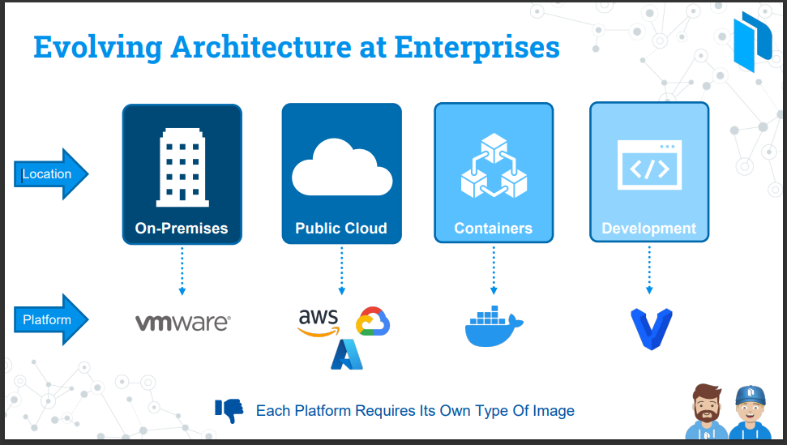
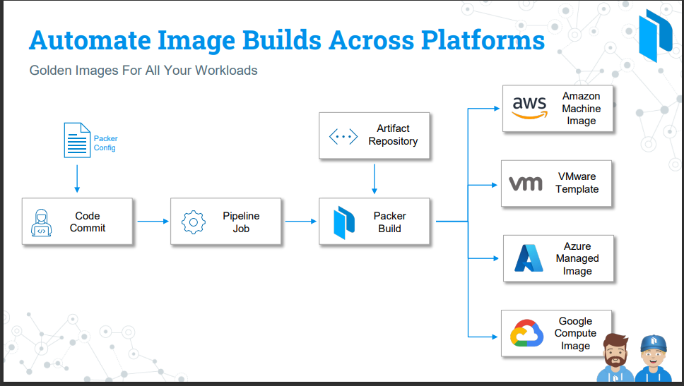
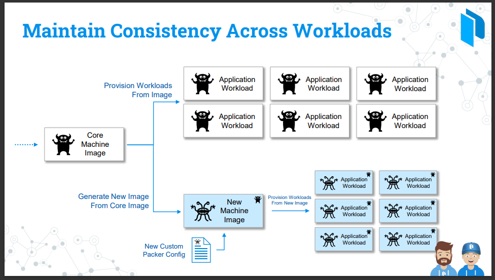

# Why to Use Hashicorp packer 

- **Evolving Architecture at Enterprises**
  
  - a lot of folks in the organization still using `on-premises` for their `workloads` which can be run on `platform` such as `VMWare/Openstack/Kubernetes/HyperV`
  
  - a lot of organization also start `consuming resources` or run their `workload` over the `public cloud providers` 
  
  - each of the `public cloud providers (AWS/GCP/Azure)` have their  own `separate backend platform` to run `workload on`
  
  - if we want to `scale out by running the containerization` using  `docker/kubernetes` we need the `docker images`
  
  - in `development` we can use `Vagrant` , where we need to ensure that the `Application runs on vagrant too`
  
  - a lot of organization are running their workload on `multiple platform` such as mentioned above 
  
  - but each of the `platform` need `its own compatible image`, we can't just put the `VMware JSON configuration` and spin that one up as the `Docker Image`
  
  - we can't take the `AWS AMI image` and convert them into an `Azure Image` 
  
  - we need to have the `tool` which `convert the one platform image` to `another platform image` , which is `packer` for the same , which is known as the `golden images`
  
  - 
  
- **How to Automate the Golden Image Build Accross Multiple Platform**
    
    - May be we have the `AWS code commit` which has the `packer template configuration`
    
    - the `packer image` tells us `how the image should` look alike
    
    - we can commit those changes into the `code repository` , once commited we have a `Pipeline Job` which will create the `packer build` which is the main `executable or action for packer` for the `image`
    
    - we can use the `packer build` to build a `new image` or `artifacts`  
    
    - we can also pull the `artifact` from the `artifact repo` and lay them on top of the `packer image` , which can be `packages/script/file` that need to lay over the `new image`
    
    - then we can use the `packer build` then can go out `build the new image` on each of the `new platform that we have mentioned`
    
    - hence we can use the `single packer template` in order to `build-out` identical images `across multiple platform`

    - 
    
  
- **Maintain consistency Accross Workloads**
    
    - if we have the `workload` running on `multiple platform` , then how can we `maintain consistency` accross the `workloads`
    
    - we can have `different type of workload such as web server or application server` on `multiple platform` for that we can take the `core machine image` that we build `AWS Code Commit` and `Pipeline`
    
    - these `core machine image` has the `security updates and requirements` that been needed for the `organization` , things which been specific to `organization`
    
    - from the `core-image` we can build the `workloads` , if the `core-machine image` has everything we need to run the `Application workload`
    
    - if we have the `different application workload` which been running on `different framework or different development startergy` then `core-machine image` might not be `enough` to spin `all workloads` as they are different compare to each other
    
    - we can use the `core-machine image` and `generate a new machine image` which has the `custom packer template configuration ` and `it can customize the core-machine image` even further to support different workloads which in turn can maintain `consistency` for the `application workload`
    
    - even if we have the `multiple different workload` we still can refer to the `core-machine image` using the `new machine config` with updated `packer template config`
    
    -  
    

- **Building Your Ideal Image for Workload**  
  
  - we have the `original machine image` from where `packer` can get its start , we have to have the `original image` in order to customize
  
  - the `original machine image` can be 
    
    - `Manufacture Image` (Microsoft, RedHat,etc)
    
    - `Manufacture ISO file` (Boot File,Image)
    
    - `Image from Cloud Provider (Market Place)`     
    
    - `Custom Image Build internally` By installing the `packages` on the `own VMWare machine` and `spinning the image`
    
    - `Image preveiously provision by packer`    

  - as we have the `original image(as above)` we can just the `packer build` and `customize` to fior to the `organization Requirement`
  
  - we can pull down the file(such as certificateor config files) and laye it over the image that we build 
  
  - we can also `install tool` such as `jq` for `application workload` which need to be installed on the `custom machine`
  
  - we can also execute `scripts` accross `New Image` that we build , also install `security requirement` for the `Application in this case out in here`
  
  - we can `tight packer together` with `configuration tool` such as `salt/chelf/ansible` , during the `packer build` we can integrate that with the `configuration mgmt tool` in order to `customize  the image further`
  
  - we can also install updates such as `Application update or Security Update or OS Update`
  
  - we can also integrate with `hashicorp vault` in order to `use secrets while creating custom images` for `application wokload`
  
  - after the `packer build been done` we have the `Brand New Image` that we can use in that case 

  - 